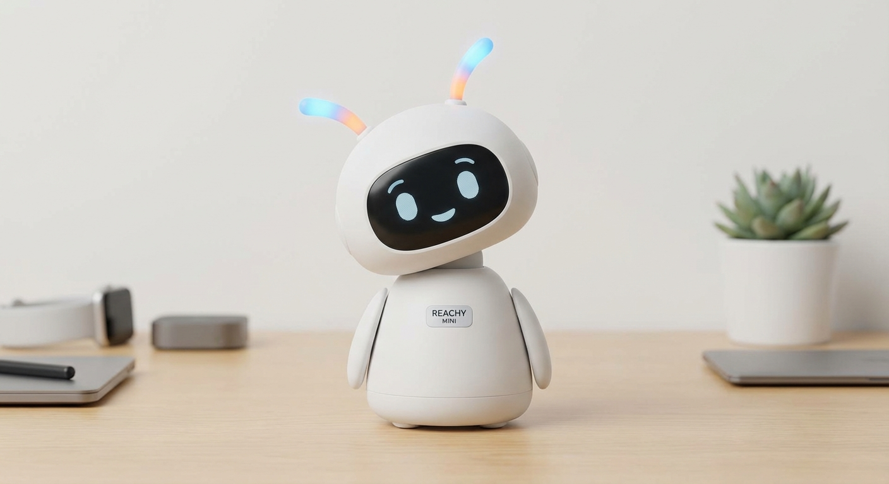

<p align="center">
  
</p>

<h1 align="center">Reachy Mini Apps & Development</h1>

<p align="center">
  <strong>Custom apps and experiments for the Reachy Mini Lite robot</strong>
</p>

<p align="center">
  <a href="https://runreachyrun.com"></a>
  <a href="https://huggingface.co/spaces/pollen-robotics/Reachy_Mini"></a>
</p>

<p align="center">
  <a href="https://github.com/BioInfo/reachy/stargazers"></a>
  <a href="https://github.com/BioInfo/reachy/fork"></a>
  <a href="https://huggingface.co/RyeCatcher"></a>
</p>

<p align="center">
  
  
  
</p>

---

## What's Here

Three apps accepted into the [official Pollen Robotics app store](https://huggingface.co/spaces/pollen-robotics/Reachy_Mini), plus documentation and examples for building your own.

| App | Description | Install |
|:----|:------------|:--------|
| [**Focus Guardian**](apps/focus-guardian/) | Productivity body-double with Pomodoro timer | `pip install git+https://huggingface.co/spaces/RyeCatcher/focus_guardian` |
| [**DJ Reactor**](apps/dj-reactor/) | Audio-reactive robot that dances to music | `pip install git+https://huggingface.co/spaces/RyeCatcher/dj_reactor` |
| [**Echo**](apps/echo/) | Companion robot with memory and proactive behaviors | `pip install git+https://huggingface.co/spaces/RyeCatcher/echo` |

---

## Apps

### Focus Guardian

<p>
  <a href="https://huggingface.co/spaces/RyeCatcher/focus_guardian"></a>
</p>

A productivity body-double that watches you work. Reachy provides gentle accountability through presence, celebrates completed sessions, and reminds you to take breaks.

- Pomodoro-style focus sessions (5-60 minutes)
- Robot expressions change based on your focus state
- Break reminders with stretch suggestions
- Session completion celebrations

### DJ Reactor

<p>
  <a href="https://huggingface.co/spaces/RyeCatcher/dj_reactor"></a>
</p>

Make Reachy dance to music in real-time. Audio analysis drives synchronized head movements, antenna wiggles, and body sway.

- Real-time beat detection and BPM estimation
- 7 genre presets (EDM, Hip-Hop, Classical, etc.)
- Bass/mid/treble frequency visualization
- Works with any audio source via BlackHole

### Echo

<p>
  <a href="https://huggingface.co/spaces/RyeCatcher/echo"></a>
</p>

A companion robot that remembers you and grows with you. Echo builds a relationship through persistent memory and proactive behaviors.

- Persistent memory across sessions (remembers your name, preferences, conversations)
- Proactive behaviors (morning greetings, break reminders, build celebrations)
- 18+ LLM models via LiteLLM (Cerebras, OpenRouter, local Ollama)
- Voice input/output support

---

## Quick Start

### Prerequisites

- macOS or Linux
- Python 3.10 - 3.13
- [Reachy Mini Desktop App](https://github.com/pollen-robotics/reachy-mini-desktop-app) (optional)

### Setup

```bash
# Clone this repo
git clone https://github.com/BioInfo/reachy.git
cd reachy

# Create virtual environment
python3.12 -m venv venv
source venv/bin/activate

# Install SDK with simulation
pip install "reachy-mini[mujoco]"
```

### Run an App

```bash
# Install an app
pip install git+https://huggingface.co/spaces/RyeCatcher/dj_reactor

# Start the daemon
python -m reachy_mini.daemon.app.main --sim --headless

# Open dashboard at http://localhost:8000
# Find the app under "Applications"
```

### Physical Robot

When your Reachy Mini Lite is connected via USB:

```bash
# No --sim flag = physical robot
python -m reachy_mini.daemon.app.main --headless
```

Same code works for simulation and hardware.

---

## Building in Public

This project is documented at [**runreachyrun.com**](https://runreachyrun.com):

- **Timeline** — Milestones and progress updates
- **Journal** — Detailed development notes
- **Claude Sessions** — AI-assisted development logs
- **Blog** — Longer-form posts about the journey

Follow along as I build apps with help from Claude Code.

---

## Documentation

| Document | Description |
|:---------|:------------|
| [Quick API Cheatsheet](docs/README.md) | Common patterns at a glance |
| [Python SDK Reference](docs/sdk/python-sdk.md) | Full API documentation |
| [Core Concepts](docs/sdk/core-concepts.md) | Architecture & coordinates |
| [Publishing Apps](docs/publishing-reachy-apps.md) | HuggingFace deployment guide |
| [Troubleshooting](docs/troubleshooting.md) | Common issues & fixes |

---

## Code Examples

### Basic Movement

```python
from reachy_mini import ReachyMini
from reachy_mini.utils import create_head_pose

with ReachyMini() as mini:
    # Look around
    mini.goto_target(
        head=create_head_pose(z=20, roll=10, mm=True, degrees=True),
        duration=1.0
    )

    # Wiggle antennas
    mini.goto_target(antennas=[0.6, -0.6], duration=0.3)
    mini.goto_target(antennas=[-0.6, 0.6], duration=0.3)
```

### Create Your Own App

```bash
reachy-mini-make-app my_awesome_app
```

See [Publishing Apps](docs/publishing-reachy-apps.md) for the full guide.

---

## Resources

<table>
  <tr>
    <td align="center"><a href="https://runreachyrun.com"></a></td>
    <td align="center"><a href="https://huggingface.co/RyeCatcher"></a></td>
    <td align="center"><a href="https://huggingface.co/spaces/pollen-robotics/Reachy_Mini"></a></td>
  </tr>
  <tr>
    <td align="center"><a href="https://github.com/pollen-robotics/reachy_mini"></a></td>
    <td align="center"><a href="https://discord.gg/2bAhWfXme9"></a></td>
    <td align="center"><a href="https://www.pollen-robotics.com/reachy-mini/"></a></td>
  </tr>
</table>

---

## Star History

<a href="https://star-history.com/#BioInfo/reachy&Date">
 <picture>
   <source media="(prefers-color-scheme: dark)" srcset="https://api.star-history.com/svg?repos=BioInfo/reachy&type=Date&theme=dark" />
   <source media="(prefers-color-scheme: light)" srcset="https://api.star-history.com/svg?repos=BioInfo/reachy&type=Date" />
   
 </picture>
</a>

---

## License

MIT © [Justin Johnson](https://github.com/BioInfo)

---

<p align="center">
  <sub>Built with Claude Code — <a href="https://runreachyrun.com">Follow the journey</a></sub>
</p>
